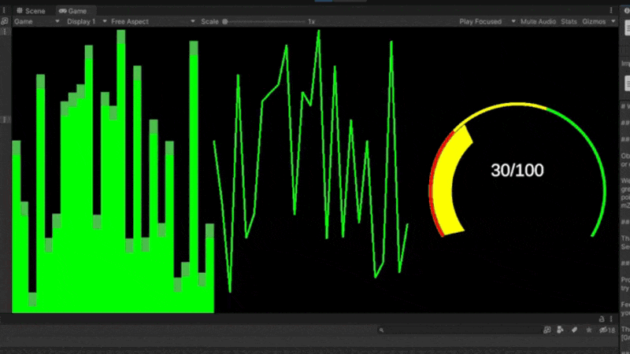

# A free and open source 2D plotting library for Unity (in 3D)

## Supported Plots
- Bar plot
- Line plot
- Gauge plot

## Install
Just put the repo in your project and use the Prefabs. Change to your liking accordingly

## How does it work internally and why?

Difficult question, here are the possible approaches:

### Approach 1: Transformation of Sprites

Obviously, it's slow. But it's easy if you need very simple and pretty static graphs or other plots.

We don't use this here, but [if you want to try it out, Code Monkey provides a great starting point.](https://www.youtube.com/playlist?list=PLzDRvYVwl53v5ur4GluoabyckImZz3TVQ)

### Possibility 2: Creating 2D UI Meshes

Thats the one we use. It's still all CPU work but the overhead is obviously less. See below for a ressource list.

### Possibility 3: Using custom GPU Shader

Probably the most performant one. Also a big TODO for the future, would love to try it out.

Feel free to contact me (or open an issue, or just a PR) if you want to do it yourself, otherwise it's on the roadmap.

The best starting point would probably be [Graphy](https://github.com/Tayx94/graphy).

## Ressources

It is not that greatly documented, so here is everything I've used as a Unity beginner.

- ([Youtube Video](https://www.youtube.com/watch?v=vD6rkjeFvnE&list=PLrtqd9jHm30NpiIOF7-SkYUmOW0D0gQh8&index=5)) A simple clean explaination on how to generate a quad and ellipse on a canvas.
- ([Blog Post](https://saticmotion.github.io/Blog/2018/06/26/Generating-UI-Meshes-in-Unity.html)) A overview of UIVertex stuff with great performance considerations.

## Contributions

Feel free to basically contribute anything. No pressure.

## LICENSE 

MIT, i.e. do whatever you want but it would be nice if you mention me the credits

